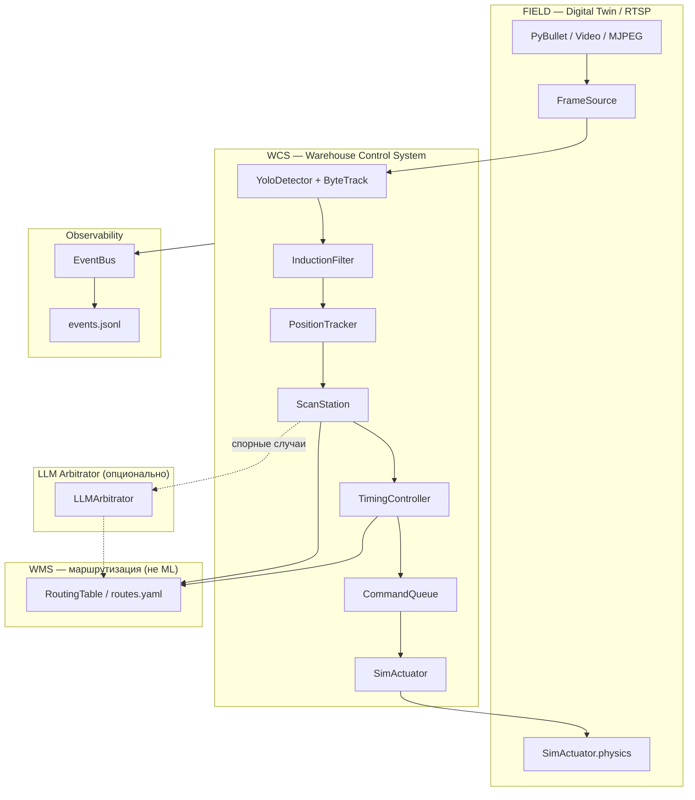

# Архитектура: Ozon Sorter (Digital Twin)

> Задача 3 хакатона Ozon Tech — интеллектуальная сортировка на конвейере.  
> Статус: **скелет v0.1** (до полной постановки 2 июля 2026).

---

## 1. Идея в одном абзаце

Мы строим **переносимый контур сортировки** в стиле реального хаба Ozon: камера над лентой → идентификация → WMS-маршрут → ПЛК-тайминг → актуатор. Источник кадра сменный: RTSP, `.mp4`, **PyBullet** (Digital Twin). CV-пайплайн и бизнес-логика **не зависят** от среды.

---

## 2. Слои системы (как на проде)



| Слой | Ответственность | Модуль |
|------|-----------------|--------|
| **Field** | Кадры, физика ленты, сила актуатора | `field/`, `sim/` |
| **WCS** | CV, трекинг, тайминг, очередь команд | `perception/`, `planning/`, `wcs/` |
| **WMS** | Правила «куда сортировать» | `wms/routing_table.py` |
| **Arbitrator** | Разрешение конфликтов CV ↔ WMS | `arbitrage/llm_arbitrator.py` |

---

## 3. Четыре операционных этапа Ozon

```
[1 Индукция] → [2 Sensing] → [3 Позиционирование] → [4 Диверсия]
```

| Этап | Реальный хаб | Наш код |
|------|--------------|---------|
| 1. Индукция | Сингулятор, зазоры | `InductionFilter` |
| 2. Sensing | Скан-портал, штрихкод, ОВХ | `ScanStation` + `YoloDetector` |
| 3. Позиционирование | Энкодер + ETA до рукава | `PositionTracker` + `TimingController` |
| 4. Диверсия | Cross-belt / pop-up / shoe | `SimActuator` + `CommandQueue` |

### Геометрия линии на кадре

```
|--[камера]----[SCAN LINE]----[ACTUATION LINE]----[zone A / B / C]--→
                  ↑                    ↑
            id зафиксирован      DivertCommand (+ lead time)
```

Параметры: `config/pipeline.yaml` → `scan_line_ratio`, `actuation_line_ratio`.

---

## 4. Контракт `FrameSource`

Единая точка замены RTSP ↔ видео ↔ PyBullet:

```python
class FrameSource(ABC):
    def read(self) -> tuple[bool, np.ndarray]: ...      # BGR кадр
    def step(self) -> None: ...                           # шаг симуляции
    def belt_position_for_bbox_center(self, cx, cy) -> float: ...
    def divert(self, track_id, direction) -> None: ...  # опционально 3D
```

**Для жюри:** `get_virtual_camera_frame()` в PyBullet и `cv2.VideoCapture` — две реализации одного интерфейса.

---

## 5. Контракт детекции (точка подмены YOLO)

```python
# perception/detector.py
def detect(frame) -> list[Detection]:
    # демо:  color_fallback_detect(frame)
    # бой:   model.track(frame, persist=True, tracker=bytetrack.yaml)
```

Физика симулятора и WCS **не меняются** при замене заглушки на YOLO.

---

## 6. Поток событий (audit log)

Файл: `logs/events.jsonl` — аналог WCS event stream.

```json
{"event": "scanned", "track_id": 17, "frame": 245, "class": "box", "zone": "chute_a", "route_source": "cv"}
{"event": "scheduled", "track_id": 17, "execute_frame": 312, "eta_frames": 67}
{"event": "diverted", "track_id": 17, "zone": "chute_a", "actuator": "cross-belt"}
{"event": "arbitrator_decision", "track_id": 42, "final": {"zone": "chute_b", "source": "llm_arbitrator"}}
```

State machine трека: `new → inducted → scanned → scheduled → diverted`.

---

## 7. LLM Arbitrator — оригинальный ход

**Проблема:** на линии бывают *спорные* решения — низкий confidence YOLO, грязный штрихкод, конфликт CV-класса и WMS-правила.

**Решение:** не «LLM вместо YOLO», а **арбитр второго уровня** (как audit в chicken_count):

```
YOLO + WMS rules  →  preliminary route
        ↓ (если confidence < 0.55 или conflict)
LLM + crop ROI    →  final zone + reasoning в arbitrator.jsonl
        ↓
CommandQueue      →  актуатор
```

| Свойство | Значение |
|----------|----------|
| Hot path | Нет — только спорные кейсы |
| Rate limit | `max_calls_per_minute` в config |
| Fallback | При ошибке API → WMS preliminary |
| Демо без API | `arbitrator.enabled: false` |

**Фраза для защиты:** «Нейросеть видит объект, WMS знает правила, LLM — *диспетчер* на пограничных случаях с объяснимым reasoning в логе».

---

## 8. Структура репозитория

```
ozon/
├── main.py                 # CLI entry
├── config/
│   ├── pipeline.yaml       # геометрия, YOLO, arbitrator
│   ├── routes.yaml         # Mock WMS
│   └── bytetrack.yaml
├── src/sorter/
│   ├── main_loop.py        # главный цикл
│   ├── core/               # типы, EventBus, JSONL
│   ├── field/              # FrameSource, induction
│   ├── perception/         # YOLO, ScanStation
│   ├── planning/           # tracker, timing, queue
│   ├── wms/                # RoutingTable
│   ├── wcs/                # SimActuator, overlay
│   ├── arbitrage/          # LLMArbitrator
│   ├── sim/                # PyBullet (после ТЗ)
│   └── ui/                 # Gradio
├── data/                   # видео, датасет
├── models/                 # веса YOLO
├── logs/                   # events.jsonl
├── ARCHITECTURE.md
├── PRESENTATION.md
└── PLAN.md
```

---

## 9. Запуск

```bash
# conda py12 (рекомендуется)
cd /home/cnn/ozon
pip install pybullet   # один раз для 3D twin
python main.py --demo
python main.py --pybullet              # 3D + YOLO + спавнер + панель метрик
python main.py --video data/belt.mp4

# LLM arbitrator
export GEMINI_API_KEY=...
# в config/pipeline.yaml: arbitrator.enabled: true
```

---

## 9a. Автоспавнер PyBullet

Модуль `sim/spawner.py` — вызывается **каждый шаг физики** из `PyBulletConveyor.step()`:

| Задача | Реализация |
|--------|------------|
| Генерация | `tick(step)`: каждые `interval_steps` → cube/sphere со случайным `y_offset` |
| Очистка памяти | `cleanup(step)`: `removeBody` если `z < cleanup_z` или `x > cleanup_x` |
| Метаданные | `kind_for(body_id)` → ground-truth для WMS и метрик точности |

```python
# Упрощённо:
env.step()  # внутри: spawner.tick → conveyor velocity → spawner.cleanup
```

Конфиг: `config/pybullet.yaml` → `spawner.interval_steps`, `lines_world.spawn_x`.

**Отличие от шаблона с `time.time()`:** ETA и актуатор через `CommandQueue` в **кадрах CV**, расстояние в **метрах** (`actuation_x - world_x`).

---

## 9b. Панель метрик

`sim/metrics.py` — overlay на окне CV:

- Spawned / Removed (утечки памяти нет)
- Scanned / Scheduled / Diverted
- **Divert accuracy %** (box→chute_a, sphere→chute_b)
- YOLO frames / detections

После остановки (`q`) — сводка в консоль.

---

## 10. Roadmap после ТЗ (2 июля)

| Приоритет | Задача |
|-----------|--------|
| P0 | Классы из ТЗ → `routes.yaml` + dataset |
| P0 | `PyBulletConveyor`: спавнер, камера, `applyExternalForce` | **готово** |
| P1 | Train YOLO11, `use_color_fallback: false` |
| P1 | Gradio: видео + лог событий + метрики |
| P2 | `pyzbar` на SCAN LINE |
| P2 | LLM arbitrator на live-демо (1–2 кейса) |
| P3 | Synthetic data export из PyBullet для дообучения |

---

## 11. Что не входит в scope (но упоминаем на защите)

- Полная WMS (батчинг, слоттинг)
- Реальный ПЛК / Modbus (опционально Factory I/O)
- Магистральная погрузка после накопителя

---

## Ссылки

- [Ozon Tech: ОВХ + YOLO на складе](https://www.pvsm.ru/machine-learning/391187)
- Внутренний план: `PLAN.md`
- Набросок презентации: `PRESENTATION.md`
