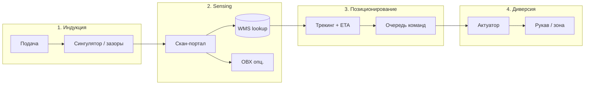
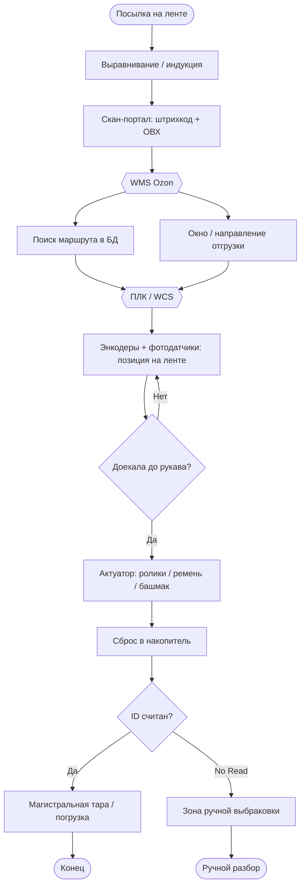
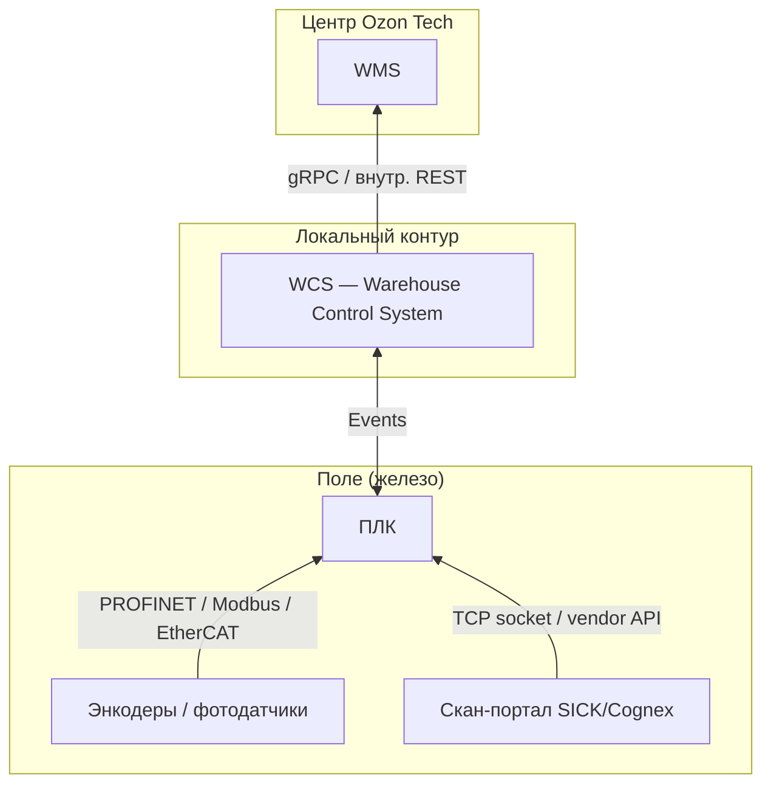

# План подготовки: трек сортировки на конвейере (задача 3)

> **Актуальный roadmap:** [HACKATHON.md](HACKATHON.md) · **ТЗ:** [task_3.md](task_3.md)  
> Ниже — исторический план (WMS-контекст); ядро задачи 3 — ПАК, категории B/C/D, STL.

> Статус: **скелет v0.2** + STL + Classifier. Хакатон: **2 июля — 13 сентября 2026**, онлайн.

---

## Цель

Система: видеопоток с конвейера → детекция → классификация → трекинг → решение о зоне сортировки → (симулированное) действие.

Симуляция допустима: реальный CV-пайплайн + виртуальный актуатор / UI.

---

## Что уже есть (опыт)

| Источник | Накопленное |
|----------|-------------|
| `chicken_count` (Yuri) | YOLO11, ByteTrack, линия подсчёта, JSON-аудит, LLM-разбор логов |
| `Maksim_Goryachev` | YOLO-seg, ByteTrack yaml, MIN_TRACK_LENGTH, Gradio + MJPEG-симулятор камеры |
| conda `py12` | Python 3.12, torch+cu130, ultralytics 8.4.83 |

---

## Архитектура (черновик) — 4 этапа

```
[1] FrameSource + InductionFilter (зазоры, MIN_TRACK_LENGTH)
[2] ScanStation: barcode/CV на SCAN LINE → MockWMS (RoutingTable)
[3] TimingController + PositionTracker (трекинг ≈ энкодер) → CommandQueue
[4] SimActuator на ACTUATION LINE → events.jsonl + overlay
    → UI (Gradio)
```

Упрощённый однострочный вид:

```
Видеопоток → detect/seg + ByteTrack → SCAN LINE → WMS lookup
    → позиционирование + ETA → ACTUATION LINE → SimActuator → UI + log
```

---

## Контекст Ozon: автоматизация и маршрутизация

Сводка по реальной инфраструктуре Ozon (пресса, [CNews](https://www.cnews.ru/news/line/2026-05-26_ozon_razvivaet_sistemu_umnoj), [Ozon Tech / PVS](https://www.pvsm.ru/machine-learning/391187)).

### Четыре слоя логистики

| Процесс | Что делает | Наш трек (задача 3) |
|---------|------------|---------------------|
| **Интеллектуальная сортировка** | 3D-сортеры / NBS: штрихкод → команда → зона отвода | **Да — это ядро хакатона** |
| **Математический батчинг** | Группировка заказов, меньше ходить сборщику | Нет — уровень WMS / сборки |
| **Алгоритм слоттинга** | Куда положить товар в мезонине (габариты + оборачиваемость) | Нет — уровень хранения |
| **Масштабирование WMS** | Тираж сортеров, конвейеров, интеграция | Нарратив для демо, не реализуем |

**Вывод:** на хакатоне эмулируем **только интеллектуальную сортировку** — узкий срез конвейерной линии. Батчинг и слоттинг — контекст «как это встраивается в Ozon», но не scope решения.

### Четыре этапа сортировки на транспортере (операционная модель)

Полный цикл на линии Ozon — от подачи до сброса в рукав:

```
[1 Индукция] → [2 Сканирование] → [3 Позиционирование] → [4 Диверсия]
   выравнивание     ID + ОВХ         ETA до шута          сброс в зону
```

#### Этап 1. Индукция (подача и выравнивание)

- Товары с зоны упаковки / приёмки → на сортировочную ленту
- **Сингулятор**: посылки по одной, равный зазор, штрихкод не перекрыт

**Эмуляция:**
- видео уже с выровненными объектами (или симулятор зазоров)
- трекинг + `MIN_TRACK_LENGTH` — не считать/не сортировать «склеенные» объекты
- фильтр: min distance между bbox центрами

#### Этап 2. Автоматическое сканирование (Sensing)

- **Скан-портал** (туннель, камеры со всех сторон)
- Штрихкод с **5 сторон** коробки / пакета
- Параллельно: **ОВХ** (габариты + вес) лазерными датчиками
- Данные → **WMS** → маршрут (кластер → хаб → направление курьера)

**Эмуляция:**
- **SCAN LINE** на кадре (как линия подсчёта в chickcount)
- идентификация: `pyzbar` / CV-класс (по ТЗ)
- опционально: bbox → pseudo-ОВХ (ширина × высота в px → мм по калибровке)
- `routes.yaml` или mock-WMS: `barcode → zone` / `cluster_siberia → chute_4`

#### Этап 3. Перемещение и позиционирование

- WMS «привязывает» посылку к **виртуальной позиции** на ленте
- Система знает **ETA** до рукава сброса (мс), учитывая скорость ленты

**Эмуляция:**
- трекинг (ByteTrack) + velocity по оси ленты
- `predict_arrival(track_id, chute_position)` = позиция + скорость × lead_time
- очередь команд: `{track_id, zone, execute_at_frame}`
- state machine трека: `new → identified → scheduled → diverted`

#### Этап 4. Диверсия (сброс в целевой карман)

Типы актуаторов на проде (для нарратива / визуализации):

| Тип | Принцип | Символ в UI |
|-----|---------|-------------|
| **Pop-up ролики** | колёса под углом из-под ленты | стрелка вбок ↗ |
| **Cross-belt** | поперечная мини-лента сбрасывает влево/вправо | ← / → |
| **Shoe sorter** | пластиковый «башмак» толкает в рукав | смещение в шут |

**Эмуляция:**
- `SimActuator.divert(track_id, zone)` — лог + смена цвета bbox / анимация «улетел в зону»
- `crossed_tracks` — один объект сортируется **один раз**
- зоны A/B/C на overlay = рукава сброса / накопительные короба



### Маппинг этапов → модули решения

| Этап Ozon | Наш модуль | Из chickcount |
|-----------|------------|---------------|
| 1 Индукция | `InductionFilter` (зазоры, min track length) | `MIN_TRACK_LENGTH`, debounce |
| 2 Sensing | `ScanStation` (barcode / CV) + `RoutingTable` | линия + audit log |
| 3 Позиционирование | `PositionTracker` + `CommandQueue` | Kalman / velocity, lead time |
| 4 Диверсия | `SimActuator` (pop-up / cross-belt / shoe) | `crossed_tracks`, событие в JSONL |

### Пример события в логе (полный цикл)

```json
{"event": "induction",   "track_id": 17, "frame": 120}
{"event": "scanned",     "track_id": 17, "barcode": "460...", "route": "chute_4", "frame": 245}
{"event": "scheduled",   "track_id": 17, "execute_frame": 312, "zone": "chute_4"}
{"event": "diverted",    "track_id": 17, "zone": "chute_4", "actuator": "cross-belt", "frame": 312}
```

### Управление процессом: WMS → ПЛК → актуатор

Программно-аппаратный контур (по открытым описаниям линий Ozon):



#### Три уровня управления

| Уровень | Роль на проде | Эмуляция в нашем решении |
|---------|---------------|--------------------------|
| **WMS** | «Мозг»: ID → кластер / город / ПВЗ → физический выход конвейера | `RoutingTable` + `routes.yaml` / mock API |
| **WCS + ПЛК** | «Нервы»: логическая команда → мотор / пневматика в **мс-окне** | `CommandQueue` + `TimingController` |
| **Энкодеры + фотодатчики** | «Глаза» ленты: скорость вала → точная позиция посылки | **ByteTrack** + velocity + `belt_speed` (px/frame) |

**Разделение ответственности** (важно для архитектуры):

```
WMS     — ЧТО делать   (chute_12, reject, manual)
ПЛК     — КОГДА делать (execute_at = f(position, speed, actuator_latency))
CV/трек — ГДЕ объект   (замена энкодера+камеры в симуляции)
```

#### Цикл «позиция → решение → сброс»

```
1. ScanStation → parcel_id
2. WMS.resolve(parcel_id) → {chute: 12, window: "siberia_hub"}
3. PLC.schedule(parcel_id, chute=12):
       execute_when(position >= chute_12_trigger - lead_time)
4. EncoderLoop / TrackerLoop каждый тик:
       if parcel at trigger AND command pending → fire actuator
5. Actuator.fire() → divert
6. if parcel_id is None (No Read) → WMS → zone_reject
```

#### No Read / выбраковка

На схеме отдельная ветка: штрихкод не считан → **зона ручной выбраковки**.

**Эмуляция:**
```python
if scan_failed(track):
    route = "zone_reject"  # или zone_manual
```
В логе: `{"event": "no_read", "track_id": 42, "zone": "zone_reject"}`.

#### Маппинг узлов схемы → Python-модули

| Узел блок-схемы | Модуль | Примечание |
|-----------------|--------|------------|
| Индукция + датчики присутствия | `InductionFilter` | зазоры между bbox |
| Скан-портал | `ScanStation` | barcode + CV + pseudo-ОВХ |
| WMS | `RoutingTable` / `MockWMS` | не ML |
| ПЛК (тайминг) | `TimingController` | `execute_at_frame` |
| Энкодеры | `PositionTracker` | трекинг вместо энкодера в симуляции |
| Доехала до рукава? | `ACTUATION LINE` | геометрия на кадре |
| Актуатор | `SimActuator` | cross-belt / shoe / pop-up — тип в логе |
| No Read | `zone_reject` | обязательная ветка |

#### Что НЕ эмулируем (но упоминаем на защите)

- Реальный ПЛК (Siemens / Omron и т.д.)
- Пневматика, сервоприводы, энкодеры на валу
- Полная WMS (батчинг, слоттинг, инвентаризация)
- Магистральная погрузка после накопителя

Эмулируем **логику и тайминг решения**, CV+трекинг — боевые.

### API и протоколы: железо → WCS → WMS

На проде **нет прямого HTTP от сканера в WMS**. Цепочка иерархична:



#### Уровень 1: Поле → ПЛК (не веб-API)

| Устройство | Протокол | Данные |
|------------|----------|--------|
| Фотоэлементы, энкодеры | PROFINET, EtherCAT, Modbus TCP | импульс, тики, скорость |
| Скан-портал | TCP/IP socket (SICK, Cognex SDK) | строка штрихкода + timestamp |

#### Уровень 2: ПЛК → WCS (события)

Локальное **event-based API** — не REST, а сообщения:

```
Event: ScanRead
  scanner_id: 4
  barcode: "OZON-123456789"
  dimensions: {x: 320, y: 180, z: 120}  # мм, с ОВХ-станции
  timestamp_ms: ...
```

Другие типы событий (эскиз):

| Event | Источник | Смысл |
|-------|----------|-------|
| `PresenceOn` / `PresenceOff` | фотодатчик | объект вошёл / вышел из зоны |
| `EncoderTick` | энкодер | сдвиг ленты на N мм |
| `ScanRead` | сканер | ID + опционально ОВХ |
| `NoRead` | сканер | штрихкод не распознан |
| `DivertDone` | ПЛК | сброс подтверждён |
| `DivertFailed` | ПЛК | сбой актуатора |

#### Уровень 3: WCS → WMS (ИТ-протокол)

WCS переводит промышленное событие в запрос к центру:

```
gRPC / внутренний REST (легковесный, мс-latency)

Request:  ResolveRoute(parcel_id, scanner_id, dimensions?)
Response: { target_pocket: 12, cluster: "siberia", reject: false }
```

Обратно в ПЛК WCS пишет простую переменную: `Target_Pocket = 12`.

#### Уровень 4: ТСД (вне конвейера)

Ручные терминалы — классика: Android app → Intent/SDK сканера → **HTTPS REST / gRPC** на серверы Ozon.  
**На наш трек не относится** (конвейер, не кладовщик с ТСД).

---

### Эмуляция API-слоя (для хакатона)

Вместо Modbus/gRPC — **единая шина событий** + опционально FastAPI как mock WMS:

```
┌─────────────┐     ScanRead event      ┌──────────┐    resolve()    ┌──────────┐
│ ScanStation │ ──────────────────────► │ MockWCS  │ ──────────────► │ MockWMS  │
│ (CV/barcode)│                         │          │ ◄────────────── │ routes   │
└─────────────┘                         └────┬─────┘  target_pocket └──────────┘
┌─────────────┐     position tick           │
│ Tracker     │ ───────────────────────────►│
│ (≈ энкодер) │                             ▼
└─────────────┘                      ┌──────────────┐
                                     │ TimingCtrl   │ ≈ ПЛК
                                     │ CommandQueue │
                                     └──────┬───────┘
                                            ▼ DivertCommand
                                     ┌──────────────┐
                                     │ SimActuator  │
                                     └──────────────┘
```

#### Контракты сообщений (эскиз, JSON)

```python
# Поле → WCS
{"type": "ScanRead", "scanner_id": 4, "track_id": 17,
 "barcode": "460...", "dims_mm": [320, 180, 120], "ts": 1719900000.123}

{"type": "NoRead", "scanner_id": 4, "track_id": 17, "ts": ...}

{"type": "PositionUpdate", "track_id": 17,
 "x_mm": 1250, "velocity_mm_s": 400, "frame": 300}

# WCS → WMS (внутренний вызов)
resolve_route(parcel_id="460...", scanner_id=4) -> {"target_pocket": 12}

# WMS → WCS → ПЛК
{"type": "RouteAssigned", "track_id": 17, "target_pocket": 12}

# ПЛК → поле
{"type": "DivertCommand", "track_id": 17, "pocket": 12,
 "execute_at_mm": 2400, "actuator": "cross-belt"}
```

#### Реализация без лишней сложности

| Слой | MVP (хакатон) | «Красиво для жюри» |
|------|---------------|-------------------|
| Поле | Python-классы, `queue.Queue` | те же |
| WCS | `EventBus` + `MockWCS` | отдельный модуль |
| WMS | `routes.yaml` + функция `resolve()` | FastAPI `POST /resolve` |
| ПЛК | `TimingController` | — |
| Лог | `events.jsonl` (все типы событий) | Gradio live feed |

**Принцип:** разделить модули так же, как на проде — даже если внутри всё in-process Python.  
На защите: «Сканер не ходит в WMS напрямую; есть WCS-прослойка и event API, как на реальной линии».

#### Зависимости (после ТЗ, опционально)

```
# fastapi + uvicorn   — mock WMS HTTP/gRPC-like endpoint
# pydantic            — схемы событий ScanRead, RouteAssigned, DivertCommand
# (Modbus/PROFINET не нужны в симуляции)
```

### Интеллектуальная сортировка (сводка)

```
Объект на ленте
  → датчики / камеры (позиция, факт присутствия)
  → идентификация (штрихкод и/или CV)
  → lookup в WMS: id → destination_zone
  → цифровая команда актуатору (отвод, ворота, лента)
  → подтверждение + лог
```

На NBS ([CNews](https://www.cnews.ru/news/line/2026-05-26_ozon_razvivaet_sistemu_umnoj)): сингулятор → 6D-сканер → ОВХ → отвод на свободную ленту. Система «уже знает» назначение посылки.

### Идентификация: штрихкод vs CV

> Каноничное описание осей «тип vs рукав»: [docs/BUSINESS_RULES.md](docs/BUSINESS_RULES.md).

| Путь | Когда на проде Ozon | Когда на хакатоне |
|------|---------------------|-------------------|
| **Штрихкод** | **основной** — куда везти (рукав / кластер) | видео с наклейками |
| **CV (класс / тип)** | тип упаковки, ОВХ; fallback при No Read | классы из ТЗ |
| **Гибрид** | штрихкод → рукав; CV → тип + подстраховка | целевая модель |

### Маршрутизация для эмуляции

**Не «нейросеть решает рукав»**, а **WMS lookup после идентификации**:

```yaml
# routes.yaml — эмуляция WMS (упрощённо)
by_barcode_prefix:
  "460": chute_a    # штрихкод → направление (основной путь)
  "461": chute_b
by_class:
  box: zone_reject  # на проде: тип без кода → выбраковка
  # в PyBullet-демо временно box→chute_a — см. BUSINESS_RULES.md §4
```

```python
# SortPlanner (эскиз)
def resolve(track) -> str:
    if track.barcode:
        return routes.get(track.barcode, "zone_reject")
    if track.class_voted:
        return routes.get(track.class_name, "zone_reject")
    return None  # ещё не готовы
```

**Две линии на ленте** (как на реальном сортере):

```
|--[камера]----[SCAN LINE]----[ACTUATION LINE]----[zone A / B / C]--→
                  ↑                    ↑
            id зафиксирован      команда актуатору (+ lead time)
```

Связка с опытом chickcount: `LineCounter` / `crossed_tracks` — тот же механизм, другое действие (`SORT` вместо `count++`).

### Что сказать жюри про «встраивание в Ozon»

- Наш контур = **станция интеллектуальной сортировки** (идентификация → маршрут → актуация).
- Батчинг и слоттинг — **выше по стеку** (WMS решает *что* собирать и *где* хранить; сортер решает *куда отвести* на ленте).
- CV-часть боевая; актуатор и WMS — эмуляция с `events.jsonl` и `routes.yaml`.

### Референс Ozon Tech по CV

[Статья про ОВХ](https://www.pvsm.ru/machine-learning/391187): классический CV не универсален → **YOLOv8m-seg**, 15 000+ реальных фото со склада, камера сверху. Прямая аналогия с нашим YOLO-seg + конвейер.

---

## Авторазметка: варианты (решение — после постановки)

**Главный неизвестный:** классы объектов для сортировки. От них зависит, сработает ли open-vocabulary подход вообще.

| Подход | Нужно знать классы? | Open-vocab | Выход | Для чего |
|--------|---------------------|------------|-------|----------|
| **A. autodistill + SAM3** | да (текстовые промпты) | да | маски → YOLO-seg/detect | пакетная разметка папки |
| **B. Grounding DINO** | да (текст → bbox) | да | bbox → YOLO-detect | когда SAM избыточен, нужны только боксы |
| **C. Grounding DINO + SAM2** | да | да | bbox → маска → YOLO-seg | плотные сцены, перекрытия |
| **D. YOLO-World** | да (текстовые классы) | да | bbox, можно сразу в inference | разметка **и** zero-shot детекция без дообучения |
| **E. Ручная / полуавто** | да | нет | полный контроль | сложные или однотипные объекты |
| **F. Готовый датасет** | — | — | — | авторазметка не нужна |

### Вариант A: autodistill + SAM3

- Репозиторий: [autodistill-sam3](https://github.com/autodistill/autodistill-sam3)
- Схема: текстовый промпт → маски/боксы → датасет → fine-tune YOLO
- Нужно: GPU, `ROBOFLOW_API_KEY`, формулировки классов из ТЗ
- Хорошо, если: объекты визуально различимы, классы описываются словами («коробка», «бутылка»)
- Плохо, если: однотипные SKU, мелкий текст на упаковке, классы не verbalizable

### Вариант B: Grounding DINO

- Схема: текст → bbox (без маски)
- Плюсы: зрелый стек, меньше зависимостей чем SAM3; bbox достаточен для detect-датасета
- Минусы: на перекрытиях слабее seg; нужен подбор формулировок промптов
- Хорошо, если: объекты не слипаются, нужен быстрый YOLO-detect датасет

### Вариант C: Grounding DINO + SAM2

- Схема: DINO находит bbox по тексту → SAM2 уточняет маску
- Плюсы: лучше на плотных сценах (опыт Максима с seg)
- Минусы: два шага, больше кода и VRAM
- Хорошо, если: нужны полигоны для YOLO-seg, autodistill/SAM3 недоступен

### Вариант D: YOLO-World

- Схема: open-vocabulary detect — классы задаются текстом при inference
- Плюсы: можно **вообще не дообучать** YOLO, если zero-shot качество приемлемо; ultralytics поддерживает YOLO-World
- Минусы: на нестандартных товарах/ракурсе конвейера часто слабее fine-tuned YOLO11
- Двойное применение:
  1. **Разметка:** прогнать кадры → сохранить bbox как псевдо-разметку → дообучить YOLO11
  2. **MVP без train:** сразу detect+track на потоке, если хватает точности

### Вариант E: Ручная / полуавтоматическая разметка

- VIA / Roboflow UI / CVAT
- Уже отработано в chickcount (`via_json_to_yolo_converter.py`, `mask-guide.md`)
- Плюсы: контроль качества; единственный надёжный путь при «плохих» классах
- Минусы: дольше по времени

### Вариант F: Готовый датасет от организаторов

- Если дадут разметку — варианты A–E **не нужны**
- Если дадут только видео — выбираем A–D по свойствам объектов

### Дерево решений (после ТЗ)

```
Есть готовая разметка?
  да → train YOLO, конец
  нет ↓
Классы описываются текстом и визуально различимы?
  нет → ручная разметка (E) или few-shot + доработка
  да ↓
Нужны маски (перекрытия)?
  да → SAM3 (A) или DINO+SAM2 (C)
  нет ↓
Достаточно zero-shot без дообучения?
  да → YOLO-World (D) как MVP
  нет → DINO (B) или SAM3 (A) → pseudo-labels → train YOLO11
```

---

## Критерии выбора (чеклист на 2 июля)

| Вопрос | Если да → | Если нет → |
|--------|-----------|------------|
| Дали готовую разметку? | Сразу train YOLO (F) | Нужна авторазметка |
| Классы известны и verbalizable? | A, B, C, D в игре | Только E или гибрид |
| Сколько классов? | 2–5: open-vocab ок | 10+: больше ручной правки |
| Однотипные объекты (различие по мелочам)? | open-vocab скорее не взлетит | E или fine-tune на малой ручной выборке |
| Объекты плотно перекрываются? | seg: A или C | detect: B или D |
| Нужен MVP без обучения? | YOLO-World (D) | pseudo-label → YOLO11 |
| Дали эталон / метрики? | Подстроить пороги под метрику | Своя валидация на hold-out |
| Есть ли GPU? | SAM3, DINO, YOLO-World | YOLO11n, CPU fallback |
| Формат потока? | Адаптер FrameSource | — |

---

## Цифровая симуляция (Digital Twin): варианты среды

ТЗ допускает симуляцию без железа. Уровни — от простого к тяжёлому:

| Уровень | Среда | Плюсы | Минусы | Когда брать |
|---------|-------|-------|--------|-------------|
| **0. Video replay** | `.mp4` + OpenCV + Gradio | уже есть опыт (chickcount, MJPEG-симулятор) | нет физики ленты | **старт по умолчанию**, если дадут видео |
| **1. 2D twin** | Python: лента + спрайты / overlay | полный контроль WCS/ПЛК/API | не 3D | быстрый MVP + event bus |
| **2. Factory I/O** | Промышленный симулятор + Modbus TCP | «настоящий» ПЛК-нарратив, легко связать с Python | лицензия, не CV-фокус | если жюри ценит PLC/автоматизацию |
| **3. ROS 2 + Gazebo** | Робототехнический стек | датчики, актуаторы, экосистема | долго поднимать, overkill | если нужна физика и несколько дней на инфру |
| **4. NVIDIA Isaac Sim** | Omniverse, синтетика, вирт. камера | synthetic data, физика, AI-first | тяжёлый GPU, крутая learning curve | если **нет** данных и много времени до финала |

**Рекомендация до ТЗ:** уровень **0**. Если нужен 3D без тяжёлых зависимостей — **PyBullet** (`pip install pybullet`, один Python-файл). CoppeliaSim — если нужен GUI-редактор сцены. Factory I/O — Modbus/ПЛК-акцент.

### PyBullet — целевой 3D-стек (после ТЗ)

**Почему PyBullet для хакатона:**
- бесплатно, `pip install pybullet`, без отдельного GUI-приложения
- virt. камера → `getCameraImage` → OpenCV → YOLO **в том же процессе**
- физика ленты через `resetBaseVelocity` / силы
- актуатор = `applyExternalForce` или смещение по Y (cross-belt)

**Что взять из типового каркаса:**
- `get_virtual_camera_frame()` → класс `PyBulletFrameSource`
- `apply_conveyor_physics()` → движение объектов по оси X
- спавн кубов/сфер разных цветов → классы для train / demo

**Что заменить (не копировать как есть):**

| В шаблоне | У нас |
|-----------|--------|
| `dummy_computer_vision` (цвет ROI) | **YOLO11 + ByteTrack** |
| `applyExternalForce` сразу при детекте | **CommandQueue** + ETA до линии актуации |
| один `test_item` | список `active_items` + `track_id` |
| `step % 10` без timestamp | фиксированный FPS + `frame_id` |
| нет WMS | `ScanRead` → `MockWMS.resolve()` → `DivertCommand` |

**Целевая структура (не один монолит, но можно стартовать с одного файла):**

```python
# sim/pybullet_env.py
class PyBulletConveyor:
    def step(self) -> None: ...
    def get_frame(self) -> np.ndarray: ...
    def divert(self, body_id: int, direction: str) -> None: ...

# perception/pipeline.py  — тот же код, что для .mp4
# planning/timing_controller.py
# main.py: while True: env.step(); pipeline.process(env.get_frame(), t)
```

**Калибровка для ETA:**
- ось ленты = X в PyBullet
- `CONVEYOR_SPEED` м/с + позиция объекта → `execute_at_step`
- SCAN_LINE_X и ACTUATION_LINE_X в координатах мира (не пиксели)

**Зависимость (после ТЗ):** `pybullet` — в `requirements-sim.txt`, не ставить сейчас.

### Три компонента эмулятора (без железа)

```
┌─────────────────────────┐   кадры          ┌──────────────────────────┐
│  3D-СИМУЛЯТОР           │ ───────────────► │  ИТ-СКРИПТ (CV + Logic)   │
│  лента, камера, физика  │ ◄─────────────── │  YOLO, WCS, ПЛК, ETA      │
└─────────────────────────┘  Modbus/socket  └──────────────────────────┘
```

| Компонент | Наша реализация |
|-----------|-----------------|
| Environment | `.mp4` / **PyBullet** / CoppeliaSim / Factory I/O |
| CV & Logic | ultralytics + ByteTrack + `MockWCS` + `TimingController` |
| Протокол | `EventBus` / Modbus TCP / `SimActuator` |

### CoppeliaSim / PyBullet vs Factory I/O

| | CoppeliaSim / PyBullet | Factory I/O |
|--|------------------------|-------------|
| Видео в YOLO | Vision Sensor → numpy **нативно** | захват экрана |
| Актуатор | socket / API симулятора | **Modbus TCP** |
| Для CV-команды | **предпочтительнее** | если акцент на ПЛК |

### Шаблон из гайдов: не копировать `sleep`

```python
# ❌ блокирует цикл при нескольких объектах
time.sleep(DISTANCE / SPEED); send_command(TRIGGER_ON)

# ✅ CommandQueue + неблокирующий loop
queue.schedule(track_id, execute_at=ts + delay, pocket=12)
```

`FrameSource`: один интерфейс для `.mp4`, CoppeliaSim, MJPEG (Максим), screen capture.

### Демо: два окна

Слева — 3D/видео ленты; справа — YOLO overlay + лог `ScanRead` → `DivertCommand`.

### Сравнение с «пошаговым планом из конкурсов»

| Шаг (типовой совет) | У нас уже / план |
|----------------------|------------------|
| 1. Датасет 200–300 фото, Roboflow | Фаза 2; авторазметка A–D; опыт VIA→YOLO |
| 2. Обучить YOLOv8n (Colab 1–2 ч) | `train_yolo11.py`, conda `py12` |
| 3. Логика ETA: «до актуатора через 1.4 с» | `TimingController` + `PositionTracker` (не только консоль) |
| 4. Связь с железом/симуляцией | `EventBus` → `SimActuator` / Modbus (Factory I/O) / Arduino |

Шаг 3 у нас **богаче**, чем в типовом совете: не print, а WCS→WMS→ПЛК→очередь команд.

### Уровень 0 — наш базовый twin (уже близко)

```
video.mp4 / RTSP / MJPEG-симулятор (Maksim)
    → тот же Python-пайплайн, что пойдёт на реальную камеру
    → SimActuator + events.jsonl
```

Это **digital twin логики**, не физики: жюри видит замкнутый контур без Isaac.

### Уровень 1 — 2D twin + event API

```python
# псевдокод: лента как 1D-координата
belt.add_parcel(class="A", x=0)
loop:
    belt.tick(dt)
  vision_pipeline.process_frame(camera.read())  # или синтетический кадр
    wcs.handle_events()
```

Камера может быть: запись, рендер 2D, или позже — Isaac. **Ядро (WCS/WMS/ПЛК) не меняется.**

### Factory I/O (если нужен «промышленный» акцент)

```
Python (CV) ──Modbus TCP──► Factory I/O (виртуальный конвейер + актуаторы)
         ◄── coils / registers ──
```

Подходит, чтобы показать связь с ПЛК-слоем; CV остаётся в Python.

### Isaac Sim (если понадобится синтетика)

- 3D-лента + физика + virtual camera → RTSP/frames в YOLO
- Domain randomization для датасета
- **Не начинать сейчас** — высокий порог входа; имеет смысл, если организаторы **не дадут** видео и нужны тысячи кадров

### Дерево выбора среды (после ТЗ)

```
Дали готовое видео?
  да → Уровень 0
  нет ↓
Нужна 3D на экране?
  нет → макет ленты + съёмка → уровень 0
  да ↓
Приоритет CV или Modbus/ПЛК?
  CV → PyBullet (1a, pip) или CoppeliaSim
  PLC → Factory I/O (1b)
```

---

## План работ по фазам

### Фаза 0 — сейчас (до постановки)

- [x] conda `py12` + ultralytics
- [x] Зафиксировать идеи и архитектуру (этот файл)
- [ ] **Не ставить** autodistill-sam3, SAM, Grounding DINO, YOLO-World — ждём ТЗ и список классов
- [ ] Держать под рукой скрипты из chickcount (extract frames, train, track+counter)

### Фаза 1 — первый час после открытия ТЗ

- [ ] Прочитать: классы, формат видео, критерии, есть ли разметка
- [ ] Выбрать **уровень симуляции** (0–4, см. Digital Twin)
- [ ] Выбрать ветку: готовый датасет / авторазметка / гибрид
- [ ] Разметить зоны на первом кадре (SCAN LINE, ACTUATION LINE, зоны A/B/C)

### Фаза 2 — данные (если нужен свой датасет)

- [ ] Нарезать кадры с конвейера (равномерно + проблемные сцены)
- [ ] Авторазметка (A–D по дереву решений) **или** ручная в VIA/Roboflow
- [ ] Выборочная проверка и правка
- [ ] `dataset.yaml` → `train_yolo11.py`

### Фаза 3 — inference + трекинг + маршрутизация

- [ ] YOLO + ByteTrack (`bytetrack.yaml` из опыта Максима)
- [ ] `MIN_TRACK_LENGTH`, `crossed_tracks` (из chicken_count)
- [ ] SCAN LINE: barcode decode и/или голосование CV-класса по `track_id`
- [ ] `MockWCS` + `routes.yaml` + `MockWMS.resolve()`
- [ ] `TimingController`: ETA в консоль/лог — *«объект A до актуатора №2 через 1.4 с»*
- [ ] ACTUATION LINE: `SimActuator` + `DivertCommand` event

### Фаза 4 — демо

- [ ] Overlay: bbox, track_id, class, zone
- [ ] `events.jsonl` / CSV аудит
- [ ] Gradio + опционально MJPEG-симулятор камеры

---

## Риски

| Риск | Митигация |
|------|-----------|
| Open-vocab не ловит классы (неизвестные SKU) | Ручная выборка 50–100 кадров → train YOLO11 |
| SAM3/DINO промпты не работают | Другой open-vocab (DINO↔YOLO-World) или ручная правка |
| ID-switch при трекинге | ByteTrack yaml, min track length, линия далеко от камеры |
| Нет GPU | YOLO11n, меньше разрешение |
| Мало времени | MVP: уровень 0 + готовые веса + event log, без Isaac/ROS |
| Нет видео от организаторов | 2D twin или Isaac synthetic — решить в фазе 1 |

---

## Зависимости (записать, не ставить)

```
# core (уже в py12)
ultralytics
torch
opencv-python

# авторазметка — по решению после ТЗ (классы объектов!)
# autodistill-sam3          # A: текст → маска
# supervision
# roboflow (API key)        # для SAM3 weights
# groundingdino             # B, C: текст → bbox
# sam2                      # C: bbox → маска
# ultralytics YOLO-World    # D: open-vocab detect (разметка или MVP)

# pybullet              # 3D twin (после ТЗ)
# pyzbar / opencv barcode  # если штрихкоды на объектах

# опционально
# gradio
```

---

## Итог

Три open-vocabulary кандидата — **кандидаты**, не обязательство:

| Подход | Когда берём |
|--------|-------------|
| SAM3 / autodistill | видео без разметки, классы на языке, нужны маски |
| Grounding DINO | нужны только bbox, проще стек |
| YOLO-World | быстрый MVP или pseudo-labels без SAM |

**Без списка классов из ТЗ выбор преждевременен.**  
Если классы не verbalizable или визуально почти одинаковы — open-vocab не спасёт, останется ручная разметка или готовый датасет.

Решение — **после постановки 2 июля**.
