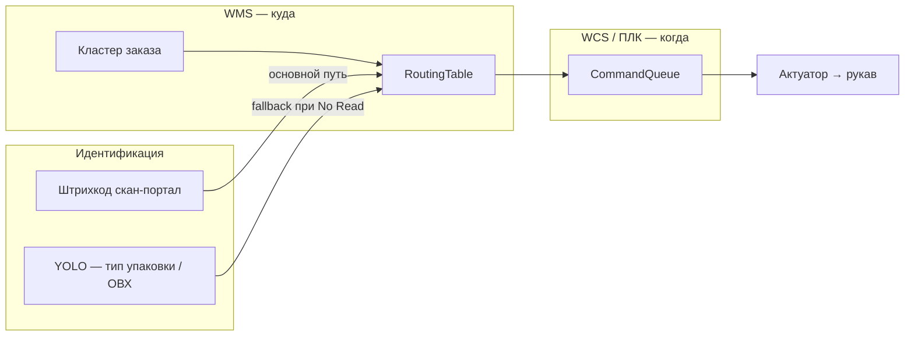

# Бизнес-правила маршрутизации

> **Единый источник истины** для команды и жюри.  
> Вопросы «что такое chute_a», «кто решает куда везти», «чем тип отличается от рукава» — ответ здесь.  
> Технические события: [EVENTS.md](EVENTS.md). Ошибки: [ERROR_CASES.md](ERROR_CASES.md).

---

## 1. Две независимые оси (главное)

На реальном хабе Ozon это **разные решения**:

| Ось | Вопрос | Кто отвечает | Примеры в проекте |
|-----|--------|--------------|-------------------|
| **Тип упаковки** | *Что это за посылка по форме/ОВХ?* | **CV (YOLO)** | `box`, `sphere`, `bag` |
| **Направление (рукав)** | *Куда её везти?* | **WMS по штрихкоду** (или кластеру заказа) | `chute_a`, `chute_b`, `chute_c` |

```
  Штрихкод 460…789  ──► WMS lookup ──► chute_a (например, кластер «Сибирь»)
  Штрихкод 461…456  ──► WMS lookup ──► chute_b (например, кластер «Москва»)

  YOLO: box          ──► тип «коробка»     (метрики, ОВХ, fallback)
  YOLO: sphere       ──► тип «сфера»       (тот же тип может ехать в любой рукав)
```

**Один и тот же тип коробки** (`box`) может попасть **и в Москву, и в Питер** — WMS решает по коду/заказу, **не по форме**.

### Что путать нельзя

| Неверно | Верно |
|---------|-------|
| «chute_a — это тип A товара» | `chute_a` — **физический рукав** / направление на хабе |
| «YOLO направляет в Москву» | YOLO даёт **тип упаковки**; город/кластер — из **WMS + штрихкод** |
| «box всегда в chute_a» | На проде: box + штрихкод `461…` → может быть `chute_b` |
| «Сфера = рукав B» | Сфера — **форма** в демо; рукав B — **география** в WMS |

---

## 2. Как это работает на проде Ozon



| Компонент | Роль | Решает |
|-----------|------|--------|
| **Штрихкод + WMS** | Маршрут посылки | **КУДА** (`chute_*`) |
| **YOLO** | Тип упаковки, контроль ОВХ | **ЧТО** (`class`), не город |
| **WCS / ПЛК** | Тайминг, очередь | **КОГДА** толкнуть |
| **CV-трекинг** | Позиция на ленте | **ГДЕ** сейчас (≈ энкодер) |

Приоритет в `RoutingTable.resolve()` (код не меняет эту политику):

1. **Штрихкод** (`by_barcode_prefix` / полный код) → рукав  
2. **Кластер WMS** (`by_cluster`: moscow, siberia, …) → рукав  
3. **CV-класс** (`by_class`) → рукав **только как fallback** при отсутствии кода  
4. Иначе → `zone_reject` (No Read / ручная выбраковка)

Поле `route_source` в `events.jsonl` показывает, какой шаг сработал: `barcode`, `wms`, `cv`, `reject`.

---

## 3. Секции `config/routes.yaml`

| Секция | Бизнес-смысл | Прод | Демо PyBullet |
|--------|--------------|------|---------------|
| `by_barcode_prefix` | Префикс EAN → рукав | **Основной** путь | Работает на видео с наклейками |
| `by_cluster` | Кластер/регион заказа → рукав | Да (API WMS) | Зарезервировано под интеграцию |
| `by_class` | CV-класс → рукав | **Только fallback** при No Read | **Единственный** путь без штрихкода |
| `zones` | Метаданные рукава (актюатор, сторона) | Да | Да |

Пример **прод-логики** (один тип — разные направления):

```yaml
by_barcode_prefix:
  "460": chute_a    # заказ в кластер A (условно «Сибирь»)
  "461": chute_b    # заказ в кластер B (условно «Москва»)
  "462": chute_c    # другой регион

# by_class — НЕ «тип A → рукав A», а запасной путь:
by_class:
  box: zone_reject      # на проде часто reject, если нет кода
  unknown: zone_reject
```

Текущий файл в репозитории **намеренно упрощён для демо без штрихкодов** — см. раздел 4.

---

## 4. Ограничения симулятора PyBullet (честно)

В 3D-демо (`python main.py --pybullet`):

| Ограничение | Следствие |
|-------------|-----------|
| На кубах/сферах **нет текстур штрихкодов** | `pyzbar` нечего читать на RGB |
| WMS не подключён к боевому API Ozon | Используется mock `routes.yaml` |

**Симуляция скан-портала в PyBullet** (`config/pybullet.yaml` → `barcode_sim`):

1. При **спавне** каждой посылке назначается «наклейка» — случайный EAN с префиксом `460` или `461` (как в `by_barcode_prefix`).
2. На **SCAN LINE**, если `pyzbar` не нашёл код на кадре, подставляется чтение из симулятора (`barcode_simulated: true` в логе).
3. С вероятностью `misread_probability` (по умолчанию 8%) читается **ошибочный** префикс (`460↔461`) → `barcode_misread: true`, маршрут по ошибочному коду (как No Read / перепутанный скан на проде).

На **видео с реальными наклейками** (после ТЗ) симулятор **не используется** — только `pyzbar` на crop.

**Устаревший demo-fallback** `by_class` срабатывает только если и pyzbar, и `barcode_sim` выключены.

### Метрики дашборда в PyBullet

`sim/metrics.py` в демо считает `processed_boxes` / `processed_spheres` по **типу объекта в спавнере** (CV ground truth), а `divert_accuracy` сравнивает с упрощённым ожиданием `box→chute_a`, `sphere→chute_b` из того же demo-fallback.  
Это **KPI симуляции**, не отчёт WMS по городам.

---

## 5. Конфликт штрихкод ↔ CV — нормальная ситуация

Разные оси → разные ответы — это ожидаемо:

- Штрихкод: «везти в **Москву**» (`chute_b`)  
- YOLO: «вижу **сферу**» (тип упаковки)

На проде **маршрут по штрихкоду обычно главнее**; CV фиксируется в логе для аудита и ОВХ.  
В коде: `barcode_cv_conflict` в metadata, опционально LLM-арбитр.

---

## 6. Примеры в логе

**Прод-сценарий:** коробка (`box`), штрихкод ведёт в Москву:

```json
{
  "event": "scanned",
  "class": "box",
  "barcode": "4611234567890",
  "zone": "chute_b",
  "route_source": "barcode",
  "reason": "barcode prefix 461"
}
```

Тип `box`, рукав `chute_b` — **нет противоречия**.

**Демо PyBullet:** куб без кода:

```json
{
  "event": "scanned",
  "class": "box",
  "barcode": null,
  "zone": "chute_a",
  "route_source": "cv",
  "reason": "cv class box (conf=0.91)"
}
```

Здесь `route_source: "cv"` — явный сигнал: сработал **fallback**, не штрихкод.

---

## 7. Фразы для защиты (копировать в питч)

1. **«Рукав — это направление из WMS по штрихкоду; тип упаковки — от YOLO. Это разные оси.»**
2. **«Один тип коробки может уехать в Москву или Питер — решает заказ в WMS, не форма.»**
3. **«В PyBullet нет наклеек — показываем fallback; на видео с EAN видно `route_source: barcode`.»**
4. **«Нейросеть не заменяет WMS: `routes.yaml` — бизнес-правила, не веса модели.»**

---

## 8. Дорожная карта к «чистым» правилам

| Шаг | Что сделать |
|-----|-------------|
| P0 | Текстуры EAN/QR на объектах PyBullet → `pyzbar` читает с кадра (вместо `barcode_sim`) |
| P1 | `by_class` на прод-политику: только `zone_reject` или отдельная секция `packaging_types` без привязки к рукаву |
| P2 | Метрики: счётчики по `zone` и по `class` раздельно |
| P3 | Интеграция `by_cluster` из mock API WMS |

---

## 9. Связанные файлы

| Файл | Содержание |
|------|------------|
| [EVENTS.md](EVENTS.md) | События, SCAN LINE, `route_source` |
| [ERROR_CASES.md](ERROR_CASES.md) | No Read, конфликт barcode↔CV |
| [ARCHITECTURE.md](../ARCHITECTURE.md) | Слои Field / WCS / WMS |
| [DEFENSE.md](../DEFENSE.md) | Питч и Q&A |
| `config/routes.yaml` | Mock WMS (с комментариями) |
| `src/sorter/wms/routing_table.py` | Реализация приоритетов |
