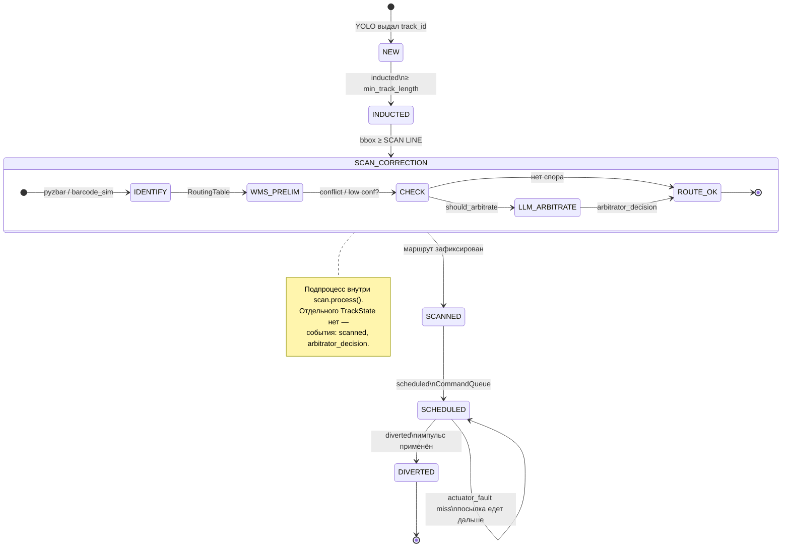

# События и состояния: понятное описание

> Для кого: жюри, разработчики команды, демо.  
> Файл лога: `logs/events.jsonl` (по одной JSON-строке на событие).  
> **Бизнес-правила (тип упаковки vs рукав):** [BUSINESS_RULES.md](BUSINESS_RULES.md) — прочитать в первую очередь.

---

## 0. Две оси: не путать тип и рукав

| | **Тип упаковки** | **Рукав (zone)** |
|--|------------------|------------------|
| **Вопрос** | Что за посылка? | Куда везти? |
| **Источник** | YOLO → поле `class` | WMS → поле `zone` |
| **Примеры** | `box`, `sphere`, `bag` | `chute_a`, `chute_b`, `zone_reject` |
| **На проде** | ОВХ, метрики, fallback | **Штрихкод → WMS → cluster → рукав** |

`chute_a` — **не** «тип A товара». Один `box` может уехать в `chute_a` или `chute_b` — зависит от штрихкода.

В PyBullet на кубах нет EAN → срабатывает **demo-fallback** (`by_class` в `routes.yaml`). В логе это видно как `route_source: "cv"`. Если есть код — `route_source: "barcode"`.

---

## 1. Словарь терминов (по-русски)

| Термин | Что это простыми словами |
|--------|--------------------------|
| **Посылка / объект** | Одна коробка или предмет на ленте |
| **Кадр** | Один снимок с камеры (номер `frame` в логе) |
| **bbox** | Прямоугольник вокруг объекта на кадре (где YOLO его «увидел») |
| **track_id** | Номер посылки в трекере (как временный паспорт, пока едет по ленте) |
| **YOLO** | Нейросеть: находит объекты и **тип упаковки** (`box`, `sphere`…) — не город назначения |
| **ByteTrack** | Алгоритм: следит, чтобы один и тот же объект сохранял один `track_id` между кадрами |
| **Индукция** | Проверка: объект реальный, а не случайный «миг» детектора (≥5 кадров подряд) |
| **SCAN LINE** | Виртуальная линия на кадре (~45% ширины): «скан-портал», здесь читают код и назначают маршрут |
| **Штрихкод** | EAN/Code128 на наклейке; читается библиотекой **pyzbar** в области bbox |
| **WMS** | Система «куда везти»: mock `routes.yaml` + `RoutingTable` (штрихкод → рукав) |
| **Маршрут / zone** | Целевой **рукав** (направление): `chute_a`, `chute_b`, `zone_reject` — не тип товара |
| **WCS / ПЛК** | Логика «когда толкнуть»: очередь команд и расчёт времени до актуатора |
| **ACTUATION LINE** | Линия срабатывания пушера (~72% ширины кадра) |
| **Актуатор** | Толкатель / cross-belt: в симуляторе — `applyExternalForce` в PyBullet |
| **Арбитр (LLM)** | Gemini по crop — **блок коррекции маршрута** на SCAN LINE (шаг ④) |
| **Блок коррекции** | Цепочка: идентификация → WMS → (арбитр?) → финальный маршрут; отдельно — коррекция исполнения (ETA, пушер) |
| **Событие (event)** | Запись в журнал: что и когда произошло (для аудита и KPI) |
| **Состояние (state)** | Внутренний этап жизни посылки в памяти программы (`NEW` → … → `DIVERTED`) |

---

## 2. Два слоя: состояние и событие

Путать их не нужно:

| | **Состояние (TrackState)** | **Событие (Event)** |
|--|---------------------------|---------------------|
| **Где** | В оперативной памяти (`TrackSnapshot`) | В файле `logs/events.jsonl` |
| **Зачем** | Программа решает, что делать дальше | Журнал для человека, жюри, отладки |
| **Пример** | `state = SCANNED` | `{"event": "scanned", ...}` |

**Важно:** программа **не читает** свой же `events.jsonl` для управления лентой.  
Сначала выполняется логика (YOLO → scan → очередь → актуатор), **параллельно** в журнал пишется событие.

```
  Управление (прямые вызовы функций)     Журнал (побочный эффект)
  ─────────────────────────────────      ──────────────────────────
  detector.detect()                      
  tracker.update()          ──────────►  inducted (если готов)
  scan.process()            ──────────►  scanned, no_read
                                          arbitrator_decision (если спор)
  timing.schedule_divert()  ──────────►  scheduled
  actuator.execute()        ──────────►  diverted, actuator_fault
```

---

## 3. Кто генерирует события и где в коде

| Событие | Кто создаёт | Файл | Когда срабатывает |
|---------|-------------|------|-------------------|
| **`inducted`** | `PositionTracker` | `planning/position_tracker.py` | Трек прожил ≥ `min_track_length` кадров → `NEW` → `INDUCTED` |
| **`scanned`** | `ScanStation` | `perception/scan_station.py` | Центр bbox пересёк SCAN LINE; маршрут назначен |
| **`no_read`** | `ScanStation` | `perception/scan_station.py` | После scan: нет штрихкода и зона = `zone_reject` |
| **`scheduled`** | `main_loop` / `sim/runner.py` | `main_loop.py` | После scan: команда попала в `CommandQueue` |
| **`diverted`** | `SimActuator` | `wcs/actuator.py` | Наступил кадр `execute_frame` — пушер сработал |
| **`arbitrator_decision`** | `LLMArbitrator` | `arbitrage/llm_arbitrator.py` | Шаг ④ коррекции: спорный scan, ответ Gemini |
| **`actuator_fault`** | `SimActuator` | `wcs/actuator.py` | Пушер не сработал (`miss`); состояние остаётся `SCHEDULED` |

Все они вызывают **`event_bus.publish(Event(...))`**.

### Как устроена шина событий

```python
# core/events.py

EventBus.publish(event):
    1. EventLogger.emit(event)  →  строка в logs/events.jsonl
    2. опционально: подписчики subscribe()  (сейчас не используются)
```

То есть **обработка ленты** идёт обыным кодом Python, а **события** — это аудит-WCS «что мы сделали».

---

## 4. Главный цикл: что происходит каждый кадр

Файл: `main_loop.py` (то же в `sim/runner.py` для PyBullet).

```
┌─────────────────────────────────────────────────────────────┐
│  КАЖДЫЙ КАДР (frame_idx)                                    │
├─────────────────────────────────────────────────────────────┤
│  1. frame = источник.read()     # видео или PyBullet-камера │
│  2. detections = YOLO.track()   # bbox, class, track_id      │
│  3. snapshots = tracker.update() # состояния + inducted      │
│  4. scan.process()               # SCAN LINE + блок коррекции маршрута │
│       ├─① barcode / sim          │
│       ├─② WMS preliminary        │
│       ├─③④ LLM? → arbitrator    │
│       └─► scanned / no_read      │
│  5. timing.schedule_divert()     # ETA → CommandQueue        │
│       └─► scheduled                                          │
│  6. queue.pop_due(frame_idx)     # пора ли толкать?           │
│       └─► actuator.execute() → diverted | actuator_fault     │
│  7. overlay на экран + метрики                               │
└─────────────────────────────────────────────────────────────┘
```

Ни один шаг не ждёт записи в файл — запись идёт **в момент** действия.

---

## 5. Автомат состояний посылки

Одна посылка = один `track_id`. Состояния хранятся в `TrackSnapshot.state` (`TrackState`).

### 5a. Состояния в памяти (TrackState)



| `TrackState` | Смысл | Ключевые события |
|--------------|-------|------------------|
| `NEW` | Трек только появился | — |
| `INDUCTED` | Объект подтверждён | `inducted` |
| *(SCAN_CORRECTION)* | *Логический подпроцесс scan* | `arbitrator_decision`? → `scanned` |
| `SCANNED` | Маршрут зафиксирован | `scanned`, `no_read` |
| `SCHEDULED` | Команда в очереди ПЛК | `scheduled` |
| `DIVERTED` | Пушер отработал | `diverted` (+ `actuator_fault` weak/overshoot в payload) |

### 5b. ASCII-схема (кратко)

```
                    ┌──────────┐
                    │   NEW    │
                    └────┬─────┘
                         │ inducted
                         ▼
                    ┌──────────┐
                    │ INDUCTED │
                    └────┬─────┘
                         │ SCAN LINE
                         ▼
              ┌──────────────────────┐
              │ БЛОК КОРРЕКЦИИ       │
              │ ① barcode · ② WMS   │
              │ ③④ LLM? (опц.)      │
              └──────────┬───────────┘
                         │ scanned
                         ▼
                    ┌──────────┐
                    │ SCANNED  │
                    └────┬─────┘
                         │ scheduled
                         ▼
                    ┌──────────┐     actuator_fault (miss)
                    │SCHEDULED │──────────────────────────┐
                    └────┬─────┘                          │
                         │ diverted                       │ (остаётся SCHEDULED)
                         ▼                                │
                    ┌──────────┐◄─────────────────────────┘
                    │ DIVERTED │
                    └──────────┘
```

**Потеря трека** (объект пропал с кадра): состояние исчезает из памяти; команда в очереди может остаться — см. [ERROR_CASES.md](ERROR_CASES.md).

---

## 6. SCAN LINE — сердце маршрутизации

Единственное место, где решается **куда** везти посылку.

### Шаг за шагом (`ScanStation.process`)

1. **Проверки:** состояние = `INDUCTED`, этот `track_id` ещё не сканировали, bbox пересёк линию.
2. **Штрихкод:** вырезаем кусок кадра по bbox → `pyzbar` → строка `"460..."` или пусто (`barcode_decoder.py`).
3. **WMS:** `RoutingTable.resolve()` — приоритет (см. [BUSINESS_RULES.md](BUSINESS_RULES.md)):
   - **штрихкод** → рукав (`by_barcode_prefix`) — mock схлопывает «код → cluster → рукав»;
   - **кластер** (`by_cluster`) — если WMS уже вернул `cluster` после lookup по коду (`route_source: wms`; в демо пока не вызывается);
   - иначе **CV-класс** (`by_class`) — fallback;
   - иначе **zone_reject**.
4. **Конфликт:** при несовпадении fallback-зон → `barcode_cv_conflict` в metadata.
5. **Блок коррекции (④):** `should_arbitrate` → `LLMArbitrator` → `arbitrator_decision`; иначе preliminary = финал.
6. **Фиксация:** `state = SCANNED`, событие `scanned`.

После этого маршрут **не меняется**, даже если YOLO на следующем кадре ошибся.

### Примеры маршрута

| Штрихкод | Класс YOLO | Итоговая зона | `route_source` | Комментарий |
|----------|------------|---------------|----------------|-------------|
| `461…` | box | chute_b | `barcode` | Тип box, направление из кода (Москва) |
| `460…` | sphere | chute_a | `barcode` | Тип sphere, но рукав из WMS — норма |
| нет | box | chute_a | `cv` | Demo-fallback PyBullet без EAN |
| нет | неизвестный | zone_reject | `reject` | + событие `no_read` |

---

## 7. Описание каждого события в логе

### `inducted` — «посылка готова к сортировке»

**Генератор:** `PositionTracker.update()`

**Смысл:** трек не мигает, объект считаем реальным.

```json
{"event": "inducted", "frame": 85, "track_id": 17, "class": "box", "track_length": 5}
```

**Что делает код дальше:** ждёт пересечения SCAN LINE.

---

### `scanned` — «на скан-портале определили маршрут»

**Генератор:** `ScanStation.process()`

**Смысл:** штрихкод и/или YOLO + WMS → назначена зона.

```json
{
  "event": "scanned",
  "frame": 245,
  "track_id": 17,
  "class": "box",
  "confidence": 0.91,
  "barcode": "4601234567890",
  "barcode_read": true,
  "zone": "chute_a",
  "route_source": "barcode",
  "reason": "barcode prefix 460"
}
```

**Что делает код дальше:** `main_loop` вызывает `timing.schedule_divert()` → очередь ПЛК.

---

### `no_read` — «не смогли идентифицировать»

**Генератор:** `ScanStation` (вместе со `scanned` на reject)

**Смысл:** нет штрихкода и нет подходящего класса → ручная выбраковка.

```json
{"event": "no_read", "frame": 300, "track_id": 12, "class": "unknown", "confidence": 0.22}
```

---

### `scheduled` — «ПЛК запланировал толчок»

**Генератор:** `main_loop.py` после успешного `schedule_divert()`

**Смысл:** посылка доедет до актуатора примерно через `eta_frames` кадров.

```json
{
  "event": "scheduled",
  "frame": 245,
  "track_id": 17,
  "zone": "chute_a",
  "execute_frame": 312,
  "eta_frames": 67
}
```

**Что делает код дальше:** каждый кадр `CommandQueue.pop_due(frame_idx)` проверяет, не пора ли.

---

### `diverted` — «актуатор сработал»

**Генератор:** `SimActuator.execute()`

**Смысл:** посылку отвели в зону (в PyBullet — сила на объект).

```json
{
  "event": "diverted",
  "frame": 312,
  "track_id": 17,
  "zone": "chute_a",
  "actuator": "cross-belt",
  "direction": "left"
}
```

**Что делает код дальше:** для этого `track_id` повторный divert не выполняется (`diverted` set).

---

### `arbitrator_decision` — «LLM скорректировал маршрут»

**Генератор:** `LLMArbitrator.arbitrate()` — **шаг ④** блока коррекции маршрута.

**Файл:** `logs/arbitrator.jsonl` (отдельно от `events.jsonl`)

**Смысл:** было preliminary от WMS; арбитр вернул финальную `zone` + `reasoning`.

**Триггеры (`should_arbitrate`):** `confidence < 0.55`; `barcode_cv_conflict`; (план) `barcode_misread`.

**Что дальше:** финальный маршрут попадает в `scanned` → `scheduled` → актуатор.

---

### `actuator_fault` — «пушер не сработал»

**Генератор:** `SimActuator.execute()` при `fault_sim` miss.

**Смысл:** команда `scheduled` наступила, импульс **не подан**; `TrackState` остаётся `SCHEDULED` (не `DIVERTED`).

```json
{"event":"actuator_fault","track_id":17,"zone":"chute_a","fault":"miss","actuator":"cross-belt"}
```

**Блок коррекции исполнения (план):** отмена команды, повтор, триггер по ACTUATION LINE — см. [FAULT_MATRIX.md](FAULT_MATRIX.md).

---

## 8. Полный пример: от появления до сброса

Коробка, `track_id=17`, штрихкод `460…`, YOLO стабилен.

| Кадр | Состояние | Модуль | Событие |
|------|-----------|--------|---------|
| 80 | NEW | `YoloDetector` | — |
| 85 | INDUCTED | `PositionTracker` | `inducted` |
| 245 | SCANNED | `ScanStation` | `scanned` |
| 245 | SCHEDULED | `TimingController` + `main_loop` | `scheduled` |
| 312 | DIVERTED | `SimActuator` | `diverted` |

```jsonl
{"event":"inducted","track_id":17,"frame":85,"class":"box","track_length":5}
{"event":"scanned","track_id":17,"frame":245,"barcode":"4601234567890","barcode_read":true,"zone":"chute_a","route_source":"barcode","confidence":0.91,"class":"box"}
{"event":"scheduled","track_id":17,"frame":245,"execute_frame":312,"eta_frames":67,"zone":"chute_a"}
{"event":"diverted","track_id":17,"frame":312,"zone":"chute_a","actuator":"cross-belt","direction":"left"}
```

---

## 9. Схема модулей и событий

```
  FrameSource          YoloDetector
  (видео/PyBullet)          │
       │                    ▼
       └────────────► PositionTracker ──► inducted
                              │
                              ▼
                   ┌── ScanStation ──────────────────────┐
                   │ ① barcode_decoder / barcode_sim    │
                   │ ② RoutingTable (WMS preliminary)   │
                   │ ③④ LLMArbitrator (коррекция)       │──► arbitrator.jsonl
                   └──────────────┬────────────────────┘
                                  ▼ scanned, no_read
                         TimingController
                                  │
                                  ▼
                   CommandQueue ◄── scheduled
                                  │
                                  ▼
              SimActuator + fault_sim ──► diverted, actuator_fault
                                  │
                                  ▼
                        logs/events.jsonl
```

| Модуль | Роль | События |
|--------|------|---------|
| `field/frame_source.py` | Картинка с ленты | — |
| `perception/detector.py` | YOLO + ByteTrack | — |
| `field/induction.py` | Фильтр зазоров | — |
| `planning/position_tracker.py` | Позиция, состояния | `inducted` |
| `perception/barcode_decoder.py` | pyzbar | — |
| `perception/scan_station.py` | SCAN LINE | `scanned`, `no_read` |
| `wms/routing_table.py` | Правила маршрута | — |
| `arbitrage/llm_arbitrator.py` | Спорные кейсы | `arbitrator_decision` |
| `planning/timing_controller.py` | ETA до пушера | — |
| `planning/command_queue.py` | Очередь ПЛК | — |
| `main_loop.py` | Связка всего | `scheduled` |
| `wcs/actuator.py` | Толкатель + fault_sim | `diverted`, `actuator_fault` |
| `core/events.py` | Запись в JSONL | все |

---

## 10. Конфигурация

```yaml
# config/pipeline.yaml
induction:
  min_track_length: 5      # кадров до inducted

lines:
  scan_line_ratio: 0.45     # SCAN LINE
  actuation_line_ratio: 0.72 # ACTUATION LINE

scan:
  barcode_enabled: true      # pyzbar на SCAN LINE
```

```bash
pip install pyzbar
# Linux: sudo apt install libzbar0
```

Штрихкоды и зоны: `config/routes.yaml`

---

## 11. Частые вопросы

**Почему в `scheduled` нет bbox и confidence?**  
Они нужны только в момент `scanned`. ПЛК знает только *когда* и *куда* — не пиксели.

**Читает ли программа events.jsonl?**  
Нет. Журнал для аудита и демо. Управление — прямые вызовы в `main_loop`.

**Где штрихкод в PyBullet-демо?**  
Включён `barcode_sim` (`config/pybullet.yaml`): при спавне — случайный EAN `460`/`461`, на SCAN LINE подставляется чтение (`barcode_simulated: true`). Иногда — ошибочный префикс (`barcode_misread: true`). На видео с наклейками — только `pyzbar`.

**chute_a — это тип A?**  
Нет. Рукав = направление из WMS. Подробно: [BUSINESS_RULES.md](BUSINESS_RULES.md).

**Что если сменился track_id?**  
См. [ERROR_CASES.md](ERROR_CASES.md), сценарий ID-switch.

---

## 12. Одна строка

```
Кадр → YOLO → inducted → [SCAN: ①② WMS → ③④ арбитр?] → scanned → scheduled → diverted | actuator_fault
         ↑ управление кодом                    ↑ события в events.jsonl + arbitrator.jsonl
```

Диаграммы архитектуры: [ARCHITECTURE.md](../ARCHITECTURE.md) §2a–2b.
