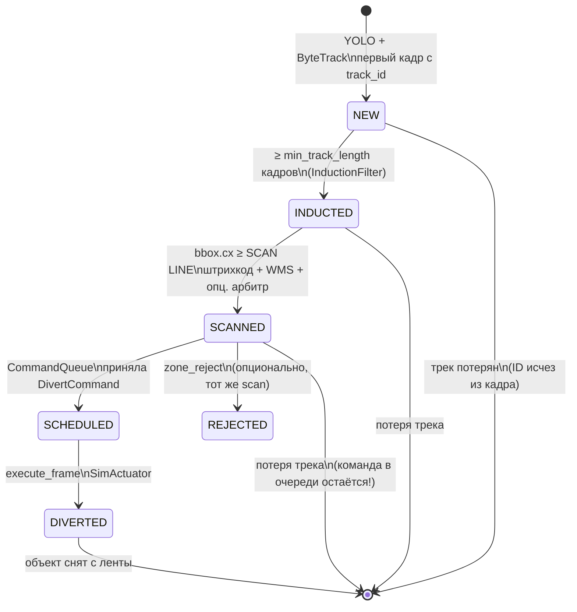

# Автомат состояний и маршрутизация (актуально на сейчас)

> Полная картина: что происходит на ленте, какие состояния у трека, какие события в `events.jsonl`,  
> **где и как читается штрихкод** и как WMS выбирает зону.

---

## 1. Два уровня: трек (FSM) и события (лог)

| Уровень | Где живёт | Назначение |
|---------|-----------|------------|
| **TrackState** | `TrackSnapshot.state` в RAM | Автомат одной посылки по `track_id` |
| **Event** | `logs/events.jsonl` | Аудит для WCS/WMS (что сообщить «наверх») |

Не каждый переход FSM пишет событие, но **все ключевые бизнес-шаги** — да.

---

## 2. Автомат состояний трека (полный)



### Таблица состояний

| State | Вход | Что делает система | Событие в JSONL |
|-------|------|-------------------|-----------------|
| **NEW** | Появился `track_id` | YOLO bbox, ByteTrack; ещё не сортируем | — |
| **INDUCTED** | Трек ≥5 кадров | Сингуляция: не мигающий шум | **`inducted`** |
| **SCANNED** | Центр bbox за SCAN LINE | **Штрихкод + WMS + арбитр** | **`scanned`** (+ `no_read` если reject без кода) |
| **SCHEDULED** | Очередь приняла команду | ETA до актуатора посчитан | **`scheduled`** |
| **DIVERTED** | Наступил `execute_frame` | Cross-belt / force | **`diverted`** |
| **REJECTED** | `zone_reject` | Сброс в ручную выбраковку | через `scanned` / `no_read` |

**Параллельно:** `CommandQueue` хранит `{track_id, zone, execute_at_frame}` — это «память ПЛК», не отдельный state в enum, но логически между SCANNED и DIVERTED.

---

## 3. Геометрия ленты

```
  ←── движение ──────────────────────────────────────────────────→

  spawn          камера (весь кадр)     │ SCAN LINE      │ ACTUATION LINE
       YOLO + ByteTrack каждый кадр    │  (~45% ширины) │  (~72%)
                                       │                │
                                       ▼                ▼
                              pyzbar в crop bbox    CommandQueue.fire
                              + WMS resolve         SimActuator
```

**Условие scan:** `bbox.cx >= scan_line_px` (центр объекта пересёк линию).

**Код:** `ScanStation.process()`, `config/pipeline.yaml` → `scan_line_ratio`.

---

## 4. SCAN LINE — что происходит по шагам

Это **единственное место**, где определяется маршрут посылки.

```
Кадр N, track в состоянии INDUCTED, cx ≥ SCAN LINE:

  ┌─ 1. ШТРИХКОД (скан-портал) ─────────────────────────────┐
  │  crop = bbox на кадре                                    │
  │  pyzbar.decode(gray) → "4601234567890" или None          │
  │  код: perception/barcode_decoder.py                      │
  └──────────────────────────────────────────────────────────┘
                          ↓
  ┌─ 2. WMS (MockWMS) ──────────────────────────────────────┐
  │  RoutingTable.resolve(barcode, class_name, confidence)   │
  │  ПРИОРИТЕТ:                                              │
  │    1) barcode prefix → zone (routes.yaml by_barcode)     │
  │    2) cluster → zone                                     │
  │    3) YOLO class → zone (by_class)                       │
  │    4) default → zone_reject                              │
  └──────────────────────────────────────────────────────────┘
                          ↓
  ┌─ 3. Конфликт barcode ↔ CV? ─────────────────────────────┐
  │  cv_zone = resolve(только class)                         │
  │  final_zone = resolve(barcode + class)                   │
  │  если barcode есть и cv_zone ≠ final_zone:               │
  │     metadata.barcode_cv_conflict = true                  │
  └──────────────────────────────────────────────────────────┘
                          ↓
  ┌─ 4. LLM-арбитр (если enabled) ──────────────────────────┐
  │  если conf < 0.55 ИЛИ barcode_cv_conflict:               │
  │     Gemini + crop → финальная zone                       │
  │  иначе: маршрут из шага 2                               │
  └──────────────────────────────────────────────────────────┘
                          ↓
  state = SCANNED, событие scanned, _scanned.add(track_id)
```

**После scan** маршрут для этого `track_id` **не пересчитывается** (даже если YOLO на следующем кадре ошибся).

---

## 5. Маршрутизация и штрихкод — примеры

`config/routes.yaml`:

```yaml
by_barcode_prefix:
  "460": chute_a
  "461": chute_b
by_class:
  box: chute_a
  sphere: chute_b
```

| Штрихкод | YOLO class | conf | Итог zone | route_source | Почему |
|----------|------------|------|-----------|--------------|--------|
| `460998...` | sphere | 0.92 | **chute_a** | `barcode` | Префикс 460 важнее класса |
| `461112...` | box | 0.88 | **chute_b** | `barcode` | Префикс 461 |
| — | box | 0.88 | **chute_a** | `cv` | Нет кода → только YOLO |
| — | unknown | 0.30 | **zone_reject** | `reject` | Нет правила + **`no_read`** |
| `460...` | sphere | 0.90 | chute_a | `barcode` | Конфликт CV (sphere→B) **игнорируется** WMS; арбитр может вызваться |

### Событие `scanned` с штрихкодом

```json
{
  "event": "scanned",
  "frame": 245,
  "track_id": 17,
  "class": "sphere",
  "confidence": 0.90,
  "barcode": "4601234567890",
  "barcode_read": true,
  "zone": "chute_a",
  "route_source": "barcode",
  "reason": "barcode prefix 460",
  "cv_zone": "chute_b",
  "barcode_zone": "chute_a"
}
```

Поля `cv_zone` / `barcode_zone` — только при конфликте.

---

## 6. Все события JSONL

| event | Когда | Ключевые поля |
|-------|-------|---------------|
| **`inducted`** | NEW → INDUCTED | `track_id`, `class`, `track_length` |
| **`scanned`** | SCAN LINE | `barcode`, `barcode_read`, `class`, `confidence`, `zone`, `route_source` |
| **`no_read`** | scan + нет barcode + zone_reject | `track_id`, `class`, `confidence` |
| **`scheduled`** | после scan | `execute_frame`, `eta_frames`, `zone` |
| **`diverted`** | актуатор | `zone`, `actuator`, `direction` |
| **`arbitrator_decision`** | внутри scan (спор) | `logs/arbitrator.jsonl`, `preliminary`, `final` |

---

## 7. Живой сценарий A → Z (штрихкод + CV)

**Коробка с EAN `460…`, YOLO стабилен, track_id=17**

| Кадр | State | Событие / действие |
|------|-------|-------------------|
| 80 | NEW | YOLO: box, conf 0.91 |
| 85 | INDUCTED | `inducted` track_length=5 |
| 120–244 | INDUCTED | едет к SCAN LINE |
| **245** | SCANNED | pyzbar → `4601234567890`; WMS → chute_a (`barcode`) |
| 245 | SCHEDULED | `scheduled` execute_frame=312 |
| 246–311 | SCHEDULED | ждём ACTUATION |
| **312** | DIVERTED | `diverted` cross-belt left |

```jsonl
{"event":"inducted","track_id":17,"frame":85,"class":"box","track_length":5}
{"event":"scanned","track_id":17,"frame":245,"class":"box","confidence":0.91,"barcode":"4601234567890","barcode_read":true,"zone":"chute_a","route_source":"barcode"}
{"event":"scheduled","track_id":17,"frame":245,"execute_frame":312,"eta_frames":67,"zone":"chute_a"}
{"event":"diverted","track_id":17,"frame":312,"zone":"chute_a","actuator":"cross-belt","direction":"left"}
```

---

## 8. Сценарий: штрихкод vs YOLO + арбитр

| Кадр | Что происходит |
|------|----------------|
| 248 | INDUCTED #42, YOLO: box conf 0.48, pyzbar: `461…` |
| 248 | WMS: barcode → **chute_b**; cv alone → chute_a; **conflict** |
| 248 | conf < 0.55 → **арбитр** смотрит crop (Gemini) |
| 248 | final: chute_b, `route_source=llm_arbitrator` или оставляет barcode |
| 248 | `scanned` + `arbitrator.jsonl` |
| 310 | `diverted` chute_b |

Арбитр **не склеивает** track_id — только текущий crop и metadata.

---

## 9. Сценарий: ID-switch (ограничение ByteTrack)

| Кадр | track_id | State | Проблема |
|------|----------|-------|----------|
| 245 | 17 | SCANNED + SCHEDULED | норма |
| 260 | — | потеря | ByteTrack потерял объект |
| 270 | 23 | INDUCTED | **новый ID**, та же коробка |
| 312 | 17 | DIVERTED | команда была на **17** |

**Истина после scan:** маршрут привязан к `track_id` в момент scan.  
**На проде:** штрихкод = источник истины; трек — только до scan.  
**В PyBullet:** `track_id` часто = `body_id` (стабильнее).

---

## 10. Конфигурация

```yaml
# config/pipeline.yaml
scan:
  barcode_enabled: true   # false — только CV (для отладки)

induction:
  min_track_length: 5
```

```bash
pip install pyzbar
# Linux: sudo apt install libzbar0
```

---

## 11. Модули в коде

| Этап | Модуль |
|------|--------|
| Детекция | `perception/detector.py` |
| Индукция | `field/induction.py` + `planning/position_tracker.py` |
| **Штрихкод** | `perception/barcode_decoder.py` |
| Scan + WMS | `perception/scan_station.py` |
| Маршруты | `wms/routing_table.py` + `config/routes.yaml` |
| Арбитр | `arbitrage/llm_arbitrator.py` |
| Тайминг | `planning/timing_controller.py` + `command_queue.py` |
| Актуатор | `wcs/actuator.py` |

---

## 12. Шпаргалка одной строкой

```
YOLO → INDUCTED → [SCAN: pyzbar → WMS(barcode>CV) → арбитр?] → SCANNED → SCHEDULED → DIVERTED
```
