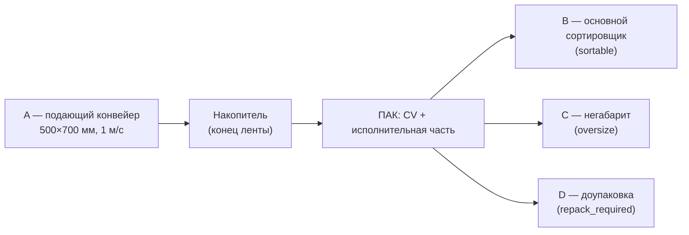

# Схема участка: точки A, B, C, D

> Источник: постановка задачи 3 (`docs/extracted/Постановка_Задача_3_сжато_2.pdf`), чертёж `docs/doc-1783009942.pdf`.

## Поток

## Фиксированные элементы (не менять в решении)

| Элемент | Параметр |
|---------|----------|
| Подающий конвейер | 500 × 700 мм, **1 м/с** |
| Конец ленты | **Накопитель** — отсюда забирает исполнительная часть |
| Остановка ленты | В базовом сценарии **не предусмотрена** |
| Позиция конвейера и инфида сортера | **Фиксированы** на схеме |

## Проектируемые командой (в пределах площадки)

- Исполнительная часть ПАК (манипулятор, толкатель, селектор и т.п.)
- Зоны вывода **B**, **C**, **D**
- Камеры, освещение, логика управления

## Рабочая зона

| Параметр | Значение |
|----------|----------|
| Площадка | **6000 × 10000 мм** |
| Макс. товар на входе ПАК | **500 × 500 × 500 мм** |
| Ролл-кейджи C и D | **1200 × 800 × 800 мм** (на схеме) |

## Маппинг в `config/routes.yaml`

| Точка | zone id | category |
|-------|---------|----------|
| B | `zone_b` | `sortable` |
| C | `zone_c` | `oversize` |
| D | `zone_d` | `repack_required` |
| — | `zone_reject` | неоднозначно / no-read / ручной разбор |

## Симуляция PyBullet (текущее / целевое)

**Сейчас:** одна лента, одна линия скана, один актуатор — упрощённый прототип.

**Целевое:**

1. Участок A: лента → зона накопителя (`accumulator_x` в `config/pybullet.yaml`).
2. Три исполнительных направления или один механизм с ветвлением на B/C/D.
3. Масштаб сцены: 1 unit = 1 м (конвейер 0,5×0,7 м в зоне A).

Координаты и размеры для следующей итерации симулятора — в [STL_IMPORT_PLAN.md](STL_IMPORT_PLAN.md), раздел «Геометрия сцены».
